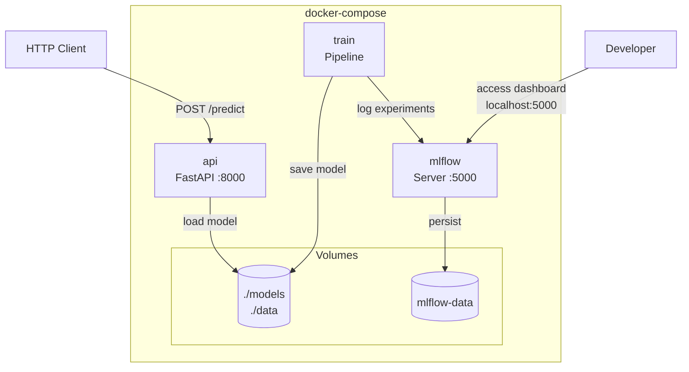
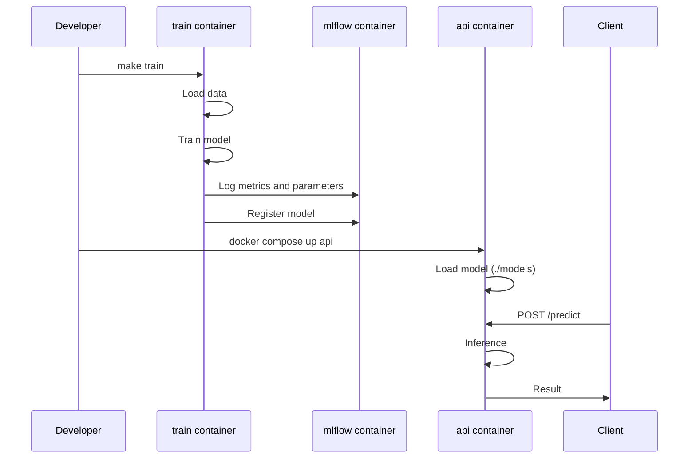
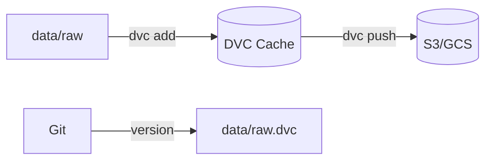
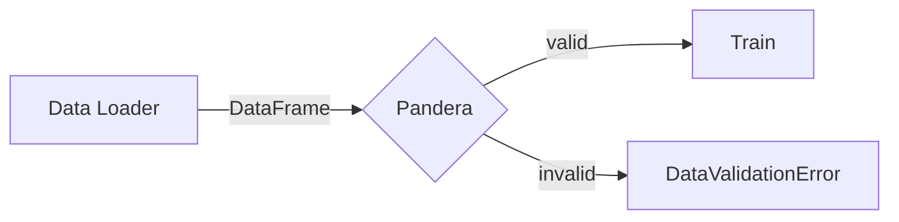
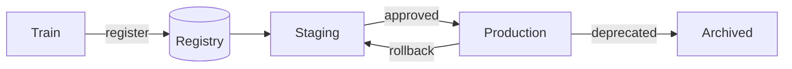
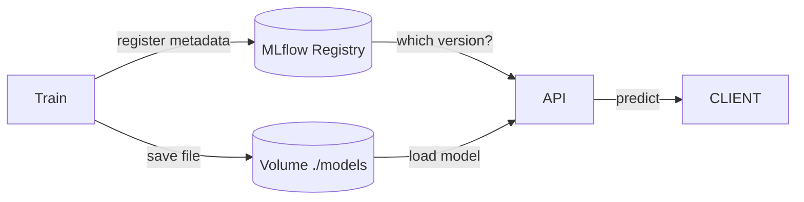
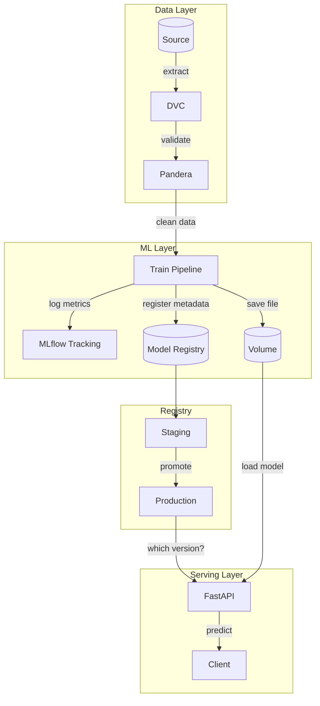
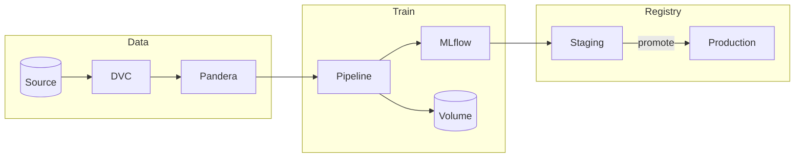
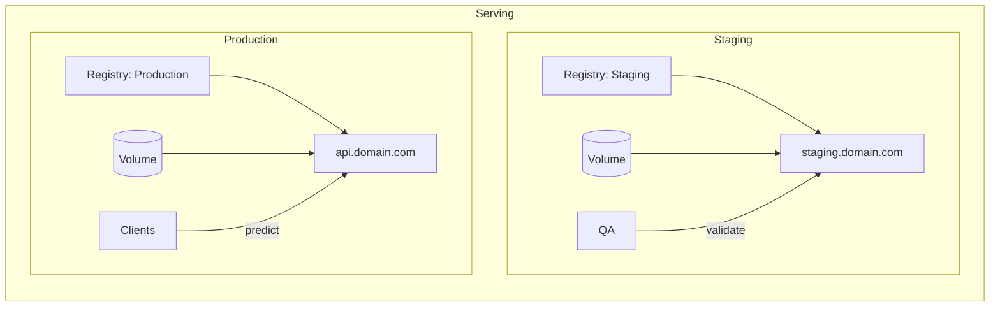

# Architecture

## Containers Overview



## Services

| Service | Port | Function | Profile |
|---------|------|----------|---------|
| api | 8000 | REST API for predictions | default |
| mlflow | 5000 | Experiment tracking and model registry | mlflow |
| train | - | Run training pipeline | training |
| test | - | Run tests | testing |
| dev | 8000 | API with hot-reload | dev |

## Commands

```bash
# Production - API only
docker compose up api

# Development - API with hot-reload
docker compose --profile dev up dev

# Training - run pipeline
docker compose --profile training up train

# MLflow - tracking server
docker compose --profile mlflow up mlflow

# Tests
docker compose --profile testing up test
```

## Data Flow



## Volumes

| Volume | Container | Mode | Description |
|--------|-----------|------|-------------|
| ./models | api, train | rw/ro | Trained models |
| ./data | train | ro | Input data |
| ./config.yaml | api, train | ro | Configuration |
| ./reports | train | rw | Logs and metrics |
| mlflow-data | mlflow | rw | MLflow database and artifacts |

## Independence

- **API**: Works standalone with local model
- **MLflow**: Optional, used only for tracking
- **Train**: Can run with or without MLflow (`integrations.mlflow.enabled`)

## Roadmap

### DVC (Data Version Control)

Git-like data versioning.



**Benefits:**
- Experiment reproducibility
- Dataset rollback
- Team sharing

### Pandera

Schema validation for DataFrames in the pipeline.



**Benefits:**
- Detect corrupted data before training
- Document expected schema
- Automated quality tests

### MLflow Model Registry

Full model lifecycle with stages.



**Benefits:**
- Deploy without API rebuild
- Instant rollback
- Approval before production
- Version audit

**Hybrid approach (production):**

MLflow manages **metadata and versioning**, but the model is loaded from the **local volume** for better performance.



**Why hybrid?**
- No download latency at startup
- API works even with MLflow offline
- No cloud egress cost
- Scales horizontally without overloading MLflow

**Implementation:**
```python
import mlflow

# Query MLflow to know which version to use
client = mlflow.tracking.MlflowClient()
model_version = client.get_latest_versions("RandomForest", stages=["Production"])[0]

# Load from local volume (path stored in metadata)
model = joblib.load(f"./models/{model_version.run_id}/model.pkl")
```

### Future Architecture

**Full view:**



**Simplified flow:**





**Environments by subdomain:**

| URL | MLflow Stage | Usage |
|-----|--------------|-------|
| `api.domain.com` | Production | Real clients |
| `staging.domain.com` | Staging | QA before promoting |
