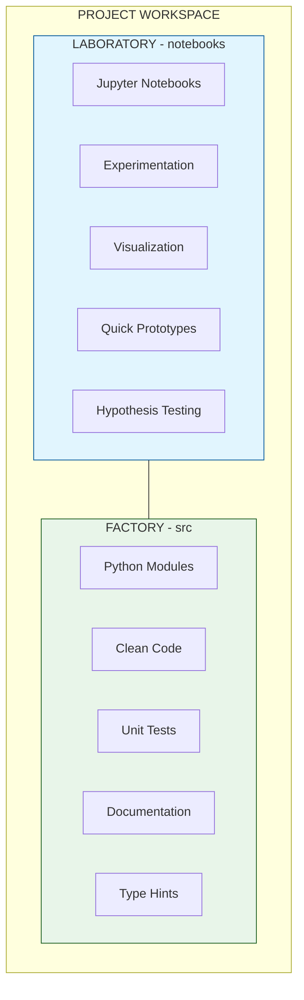
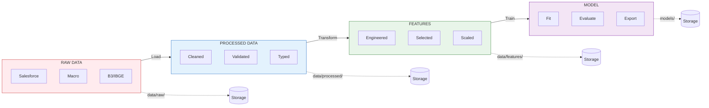
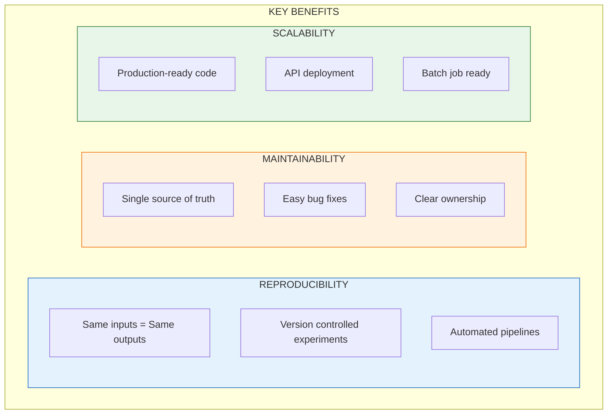

# Project Methodology and Workflow

This document describes the development philosophy adopted in this Machine Learning project, aligned with best practices in software engineering and data science in mature corporate environments.

## The Philosophy: Laboratory vs. Factory

Our approach divides work into two distinct environments, each with clear purposes:

### 1. The Laboratory (Jupyter Notebooks)

* **Location:** `notebooks/` directory
* **Purpose:** Discovery, rapid experimentation, and hypothesis validation.
* **Characteristics:**
  * Focus on agility and visualization.
  * Allows controlled "messiness" (out-of-order cells, multiple prints, exploratory graphs).
  * Answers questions like: "Does variable X correlate with the target?", "What is the Dollar's impact on sales?".
* **Project Example:** Notebooks `2.0-lab-salesforce-funnel-analysis.ipynb` and `3.0-lab-market-correlation-analysis.ipynb`.

### 2. The Factory (Source Code)

* **Location:** `src/` directory
* **Purpose:** Production, automation, reproducibility, and scale.
* **Characteristics:**
  * Clean, modular, and object-oriented code.
  * Testable and versioned.
  * Ready to be integrated into CI/CD pipelines.
* **Project Example:** Scripts in `src/data/`, `src/features/`, and `src/pipeline.py`.

---

## The Development Cycle (The Loop)

Development is not linear, but rather an iterative cycle of continuous improvement:

1. **Exploration (Notebook):**

   * The data scientist tests a new idea (e.g., creating a moving average feature).
   * Validates whether the idea brings performance gains to the model.
2. **Refactoring (Script):**

   * If the idea was validated, the logic is extracted from the notebook.
   * The code is rewritten in a robust and modular way within `src/` (e.g., creating a new class in `src/features`).
3. **Integration (Pipeline):**

   * The main pipeline (`src/pipeline.py`) is updated to use the new official component.
   * The model is retrained automatically.
4. **Restart:**

   * Return to the notebook to explore the next hypothesis.

## Benefits of This Approach

* **Reproducibility:** Anyone (or any machine) can run the pipeline and obtain the same result.
* **Maintainability:** Bugs are fixed in a single place (`src/`), not scattered across dozens of notebooks.
* **Scalability:** Code in `src/` can be easily deployed to production (APIs, Batch Jobs), while notebooks are difficult to operationalize.

---

## Visual Diagrams

### Philosophy: Laboratory vs. Factory

### Data Flow Pipeline

### Benefits Summary

